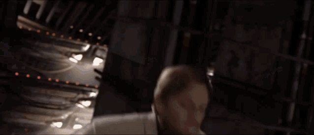

<h1 align="center"> :point_right: 𝘈𝘣𝘰𝘶𝘵 𝘮𝘦 :point_left: </h1>
             

  <h4>Currently living in Maastricht (NL)</h4>
  <h4>Full Stack Web Developer</h4>
  <h4>Software Developer</h4>
  <h4>Data Science <a href="https://maastrichtuniversity.nl">𝚜𝚝𝚞𝚍𝚎𝚗𝚝</a></h4>

<h1 align="center">𝘕𝘦𝘹𝘵 𝘴𝘵𝘦𝘱𝘴:arrow_lower_right: </h1>
             

  <h4>Start contributing to a few open-source projects I like</h4>
  <h4>Apply to my university <a href="https://www.maastrichtuniversity.nl/research/dke/honours-programme">𝙺𝙴@𝚆𝚘𝚛𝚔</a> honours</h4>
  <h4>Learn a new (human) language</h4>
  <h4>Keep developing for passion</h4>

<h1 align="center">:arrow_lower_left:𝘊𝘰𝘯𝘵𝘢𝘤𝘵 𝘮𝘦</h1>
 

  
    
  
    
  
    
  

